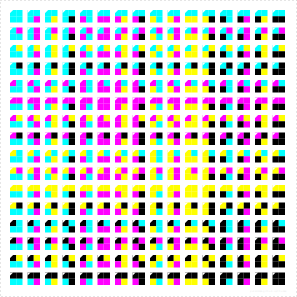

# ಚುಕ್ಕೆ - Chukké - Unique Tag Generator

Chukké (ಚುಕ್ಕೆ) means "dots" or "marks" in Kannada, which perfectly represents this tool's purpose: creating unique visual identification tags for tracking or marking items.

🚀 **[Try it now: Launch Chukké Tag Generator](https://pvnkmrksk.github.io/Chukke/)**

  
  
<em>Animation showcasing the variety of unique tags possible with Chukké</em>

## What is Chukké?

Chukké generates unique 2×2 color quadrant tags, each with its own distinct identification number. The system uses a base-4 encoding which allows for thousands of unique combinations using just four colors.

  

### Key Features

- Generate sheets of unique tags with customizable quadrant colors
- Include orientation markers (corner notch and bottom line) for easier identification
- Customize tag size, spacing, and layout
- Compatible with standard paper sizes or custom dimensions
- Export as SVG for perfect printing at any scale
- Self-contained web app with no external dependencies
- Fully works offline in any modern browser

## How It Works

1. **Base-4 System**: Each tag represents a number in base-4, using four positions (quadrants)
2. **Color Mapping**: Each of the four digits (0,1,2,3) maps to one of your chosen colors
3. **Tag Sequence**: Tags are generated in sequential order starting from your chosen starting number
4. **Orientation Markers**: A corner notch and/or bottom line helps identify the correct orientation

## Usage Guide

### Basic Use

1. Set your four quadrant colors and their identifying letters (default: CMYK)
2. Choose your canvas size (standard paper sizes or custom dimensions)
3. Configure tag size, spacing, and layout
4. Set orientation marker options
5. Click "Generate Tags" to preview the results
6. Download the SVG file for printing or further processing

### Recommended Settings

- **For small items**: 10-15mm tiles with 3-5mm margins
- **For standard labels**: 20-25mm tiles with 5mm margins
- **For large items**: 30-50mm tiles with 7-10mm margins

### Practical Applications

- **Inventory tracking**: Generate unique tags for bins, shelves, or containers
- **Research**: Tag experimental subjects or samples with non-invasive identifiers
- **Event management**: Create unique badges or identifiers for participants
- **Board game prototyping**: Create tokens with unique identifiable patterns
- **Educational tools**: Demonstrate base-4 numbering systems with visual representations

## Example Output

Below is an example of what generated tags look like. Each tag has a unique color pattern representing its ID number, with orientation markers for clear positioning.

  

The SVG output is vector-based, so it scales perfectly to any size and prints with high quality. You can:
- Print directly from the browser
- Import into design software
- Use with label printers (adjust size accordingly)

## Tag Diversity

With the default CMYK color system, Chukké can generate 256 unique tag patterns (4^4). The animated GIF at the top of this README demonstrates this diversity by showing various tag patterns created using the base-4 encoding system.

For custom applications, you can:
- Use any 4 colors of your choice
- Expand to up to 8 colors for even more unique combinations (8^4 = 4,096 possibilities)
- Reduce to just 2 colors for simpler binary encoding

## Technical Implementation

Chukké is implemented as a stand-alone HTML file with inline JavaScript and CSS. The application runs entirely in the browser and requires no server-side processing.

The SVG generation uses precise mathematical calculations to ensure proper scaling and positioning of all elements, making the output suitable for high-quality printing.

## License

MIT License

## Contributing

Contributions, suggestions, and bug reports are welcome! Feel free to open an issue or submit a pull request.

---

  Made with ❤️ by <a href="https://twitter.com/pvnkmrksk" target="_blank">@pvnkmrksk</a>

